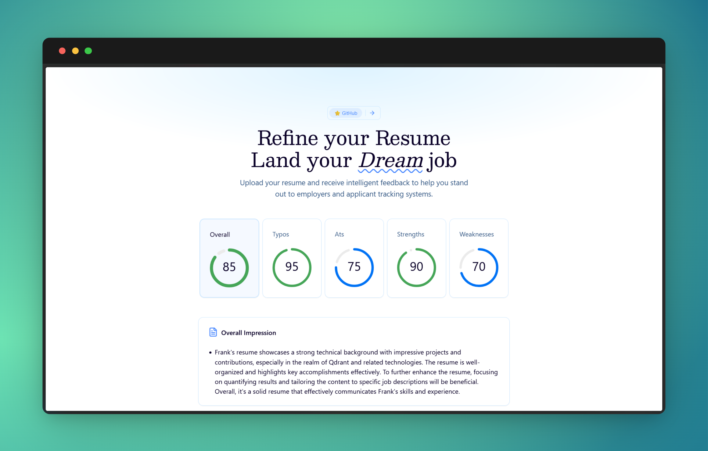

<div align="center">

# [📄 Rate my Resume](https://rate-my-resume-pls.vercel.app)

AI-powered resume analysis to help you land your dream job.



**Try it here** 👉 [rate-my-resume-pls.vercel.app](https://rate-my-resume-pls.vercel.app)

</div>

## ✨ Features

- **Smart Resume Analysis**: Upload your resume and get detailed feedback
- **ATS Optimization**: Get insights on how to make your resume more ATS-friendly
- **Modern UI**: Clean and responsive interface built with Next.js and Tailwind CSS
- **AI-Powered**: Leverages Google Gemini API for intelligent analysis

## 🧰 Tech Stack

- Next.js 15
- React 19
- TypeScript
- Tailwind CSS
- Radix UI
- Tanstack Query
- Google Gemini API
- Vercel AI SDK

## 💻 Getting Started

1. Clone the repository
2. Install dependencies:
   ```bash
   pnpm install
   ```
3. Create a `.env` file with your API keys:
   ```
   GOOGLE_API_KEY=your_gemini_api_key
   ```
4. Run the development server:
   ```bash
   pnpm dev
   ```
5. Open [http://localhost:3000](http://localhost:3000) in your browser

## 🛠️ Development

- Built with Next.js App Router
- Uses Turbopack for faster development
- TypeScript for type safety
- ESLint and Prettier for code quality
- Tailwind CSS for styling

## 📜 License

MIT

## 💙 Acknowledgements

- [Vercel AI SDK](https://sdk.vercel.ai/) for AI integration
- [Google Gemini API](https://ai.google.dev/) for AI analysis
- [Shadcn-UI](https://ui.shadcn.com)
- [Gauge Component](https://gauge.onur.dev/)

<div align="center">

<strong>⭐ Leave a start maybe? ⭐</strong>

<a href="https://github.com/buneeIsSlo/rate-my-resume">Source</a>
| <a href="https://twitter.com/awwbhi2" target="_blank">Twitter</a>
| <a href="https://github.com/buneeIsSlo" target="_blank">GitHub</a>

</div>
